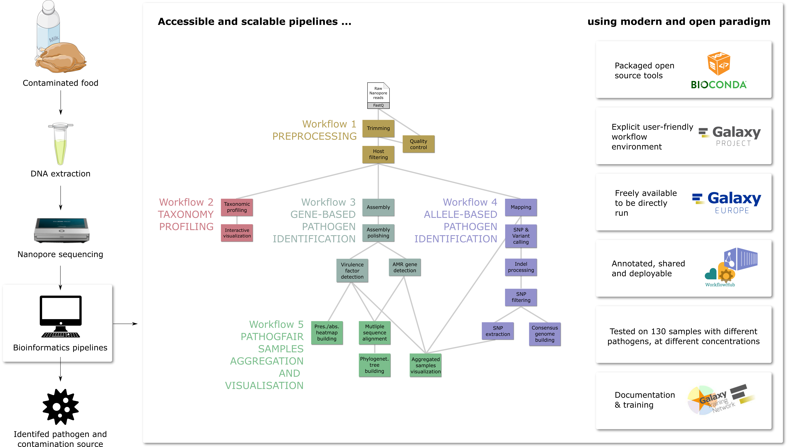

---
media:
  - mastodon-eu-freiburg
  - matrix-eu-announce

mentions:
  mastodon-eu-freiburg:
    - bebatut@piaille.fr 

hashtags:
  mastodon-eu-freiburg:
    - metagenomics
    - pathogen
    - usegalaxy

---

**1/6 🚀 Exciting news in pathogen detection!**  
Our new PathoGFAIR preprint introduces FAIR and adaptable (meta)genomics workflows for detecting and tracking foodborne pathogens. This project started nearly three years ago as a collaboration with Biolytix, a swiss SME. 🌟

🔗 [Preprint](https://www.biorxiv.org/content/10.1101/2024.06.26.600753v1)  
🔗 [Blogpost](https://galaxyproject.org/news/2024-07-08-pathogfair-preprint/)

**2/6 🏁 Project Origins**  
The journey began with funding from EOSC-Life for Industry Collaboration to modernize and validate Biolytix's bioinformatic pipelines. The goal? To make pathogen detection workflows accessible and scalable via the Galaxy platform. 🌐

🔗 [Project Background](https://galaxyproject.org/news/2021-12-08-pathogen-detection-eosc-life-grant/)

**3/6 🔍 What's in PathoGFAIR?**  
PathoGFAIR consists of 5 workflows:
- **Preprocessing**
- **Taxonomy Profiling and Visualization**
- **Gene-based Pathogen Identification** with assembly, AMR and VF gene detection
- **Allele-based Pathogen Identification** with variant calling
- **PathoGFAIR Samples Aggregation and Visualisation** including phylogenetic analysis

🔗 [Workflows](https://usegalaxy-eu.github.io/PathoGFAIR/#how-to-find-pathogfair-workflows)

**4/6 🌟 Embracing FAIR Principles**  
These workflows adhere to FAIR (Findable, Accessible, Interoperable, Reusable) principles, ensuring they are easy to find (via WorkflowHub and Dockstore), share, adapt, and integrate with other data and tools. This enhances collaboration and transparency in pathogen research.

**5/6 📚 Training Material Available**  
To support users, a comprehensive tutorial have been developed. These resources guide users through the workflows, ensuring they can effectively utilize the tools for their research and public health initiatives.

🔗 [Tutorial](https://training.galaxyproject.org/training-material/topics/microbiome/tutorials/pathogen-detection-from-nanopore-foodborne-data/tutorial.html)

**6/6 🌍 Impact on Global Health**  
PathoGFAIR is set to revolutionize food safety and pathogen tracking, providing robust tools for researchers and public health officials worldwide. By improving detection capabilities, we can better protect public health. 🌎🔬

🔗 [Preprint](https://www.biorxiv.org/content/10.1101/2024.06.26.600753v1)  
🔗 [Blogpost](https://galaxyproject.org/news/2024-07-08-pathogfair-preprint/)