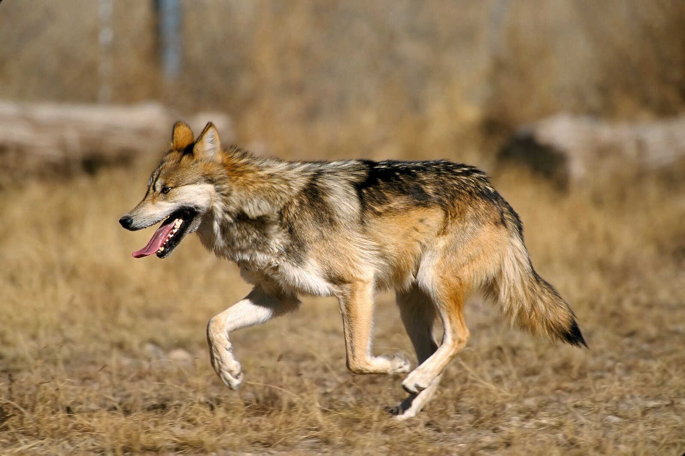

---
media:
- bluesky-vgp
- bluesky-galaxyproject
- linkedin-galaxyproject
hashtags:
  bluesky-galaxyproject:
  - UseGalaxy
  - VertebrateGenomesProject
  linkedin-galaxyproject:
  - UseGalaxy
  - VertebrateGenomesProject
  bluesky-vgp:
  - UseGalaxy
mentions:
  bluesky-galaxyproject:
  - vertebrategenomes.bsky.social
  bluesky-vgp:
  - galaxyproject.bsky.social
---

We have finished the curation of Canis lupus baileyi (Mexican wolf) genome, mCanLup2. Assembly was done by Linelle Abueg on Galaxy. Curation was done by Erick Duarte. Files are available on GenomeArk: https://genomeark.s3.amazonaws.com/index.html?prefix=species/Canis_lupus/mCanLup2/assembly_curated/

📸 https://en.wikipedia.org/wiki/Mexican_wolf
